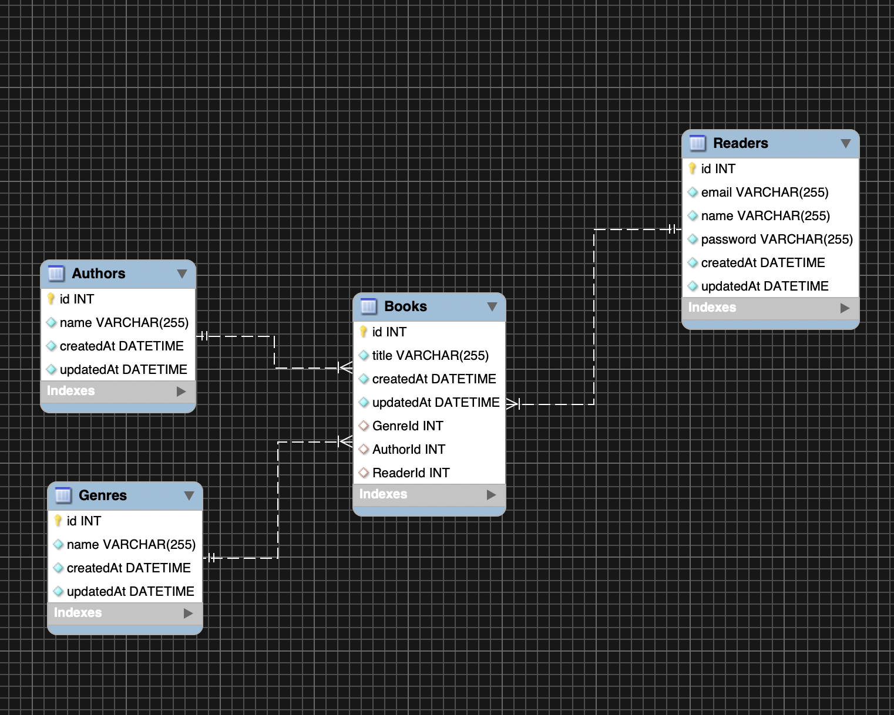

# Book Library API - Project Overview

A restful API which takes incoming HTTP requests and performs various CRUD operations on a MySQL database based on these incoming requests. 

The project is designed to replicate how an online book library may work. Readers can rent out various books and the library's database tracks information such as which readers are renting out which books, and the genres and authors that correspond to these books. The database contains book records, which have corresponding author and genre records attached to them, as well as "reader" records to highlight which library user is currently renting them out. 

The relationships and schema of the library's database can be seen below:

All of the routes that have been set up can be found in App.js. Please feel free to try these locally through Postman, or alternatively you can view the deployed Heroku data below:

https://booklibrarymcrcodes.herokuapp.com/readers

https://booklibrarymcrcodes.herokuapp.com/authors

https://booklibrarymcrcodes.herokuapp.com/genres

https://booklibrarymcrcodes.herokuapp.com/books

As you can see from the "books" link above, there are various relationships between the tables. For example, the books in the books table have their respective authors and genres attached to them. Furthermore, if the book is being loaned out by a reader, the reader's information will also be attached to the book. 

## Running the project locally 

To run the project locally you will need a local installation of SQL (we achieved this by pulling a MySQL image through docker and running the database inside this container).

Once you have done this, the app will run on port 3000 by using the command "npm start". If you would like to run the tests you can do so via the command "npm test".

## Technologies and Languages used

* MySQL and MySQL Workbench
* Docker (Used to run the database on locahost)
* Github
* Express
* Sequelize 
* Mocha, Chai and SuperTest
* Dotenv
* Postman
* Heroku
* Node
* Javascript
* SQL

# Ackowledgements 

Completed as part of the Manchester Codes Full Stack Engineering Bootcamp

# Author 

Scott Hannabuss